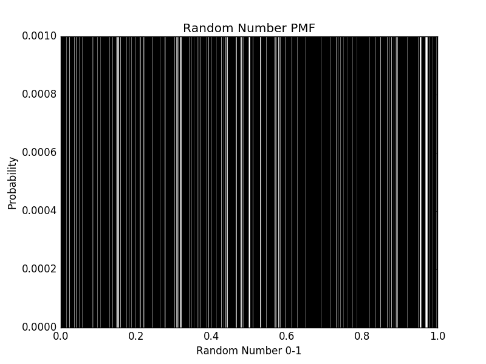
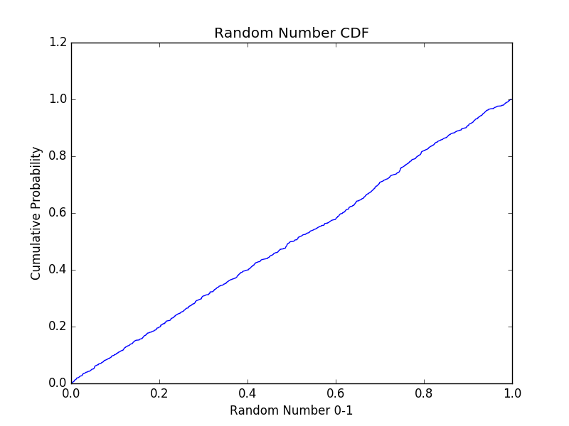

[Think Stats Chapter 4 Exercise 2](http://greenteapress.com/thinkstats2/html/thinkstats2005.html#toc41) (a random distribution)

>>Below is the PMF for the random. Since no two numbers were duplicated, each number has the same probability of selection (e.g. P=0.001). However, the below PMF is not particularly useful in determining whether or not our distribution of numbers is truly uniform over the range 0-1, or if instead they are clustered around some values:

>>The CMF for the same distribution of random numbers makes the distribution much more clear. The linear-like increase in cumulative probability indicates that the distribution is, actually, uniform:

>>Below is the code I used to produce a list of 1,000 random integers using random.random() and create the corresponding PMF and CDF's

	##Exercise 4-2 (Distribution of Random Numbers 0-1)

	##Use random.random to generate list of random numbers
	import random as rd
	from matplotlib import pyplot as pp

	rd_list=[]
	i=0

	while i<1000:
		r=rd.random()

		rd_list.append(r)
		i+=1

	rd_list.sort()

	##Create PMF & CDFs for Random Number List
	def ProduceHist(s): #input is a Pandas series or list
		d={}

		for i in range(0, len(s)):
			d[s[i]]=d.get(s[i],0)+1

		return d

	def ProducePMF(s):
		t=ProduceHist(s).items() #convert to a tuple so can be sorted and sliced
		t.sort()
		new_t=[] #since tuples are immutable, create a new tuple with probs instead of freqs

		for i in range(0, len(t)):
			n=t[i][0]
			p=float(t[i][1])/ len(s)
			new_t.append((n,p))

		return new_t

	def ProduceCDF(s):
		t=ProducePMF(s)
		c=0
		new_t=[]

		for i in range(0, len(t)):
			n=t[i][0]
			c+=t[i][1]
			new_t.append((n,c))

		return new_t

	rd_pmf=ProducePMF(rd_list)
	rd_cdf=ProduceCDF(rd_list)

	print rd_pmf[0:5] #check
	print rd_cdf[0:5] #check

	##Plot the PMF and CDF distributions
	#Create lists from PMF/ CDF nested tuple-lists to read into PyPlot
	rd_nums=[]
	rd_pmf_vals=[]
	rd_cdf_vals=[]

	for i in range(0,1000):
		rd_nums.append(rd_pmf[i][0])
		rd_pmf_vals.append(rd_pmf[i][1])
		rd_cdf_vals.append(rd_cdf[i][1])

	print rd_nums[0:5]
	print rd_pmf_vals[0:5]
	print rd_cdf_vals[0:5]

	#Graph the PDF
	width=0.0001

	pp.bar(rd_nums, rd_pmf_vals, width)
	pp.title("Random Number PMF")
	pp.xlabel("Random Number 0-1")
	pp.ylabel("Probability")
	pp.savefig("Random_Number_PMF.png")
	pp.cla()

	#Graph the CDF
	pp.plot(rd_nums, rd_cdf_vals)
	pp.title("Random Number CDF")
	pp.xlabel("Random Number 0-1")
	pp.ylabel("Cumulative Probability")
	pp.savefig("Random_Number_CDF.png")
	pp.cla()

